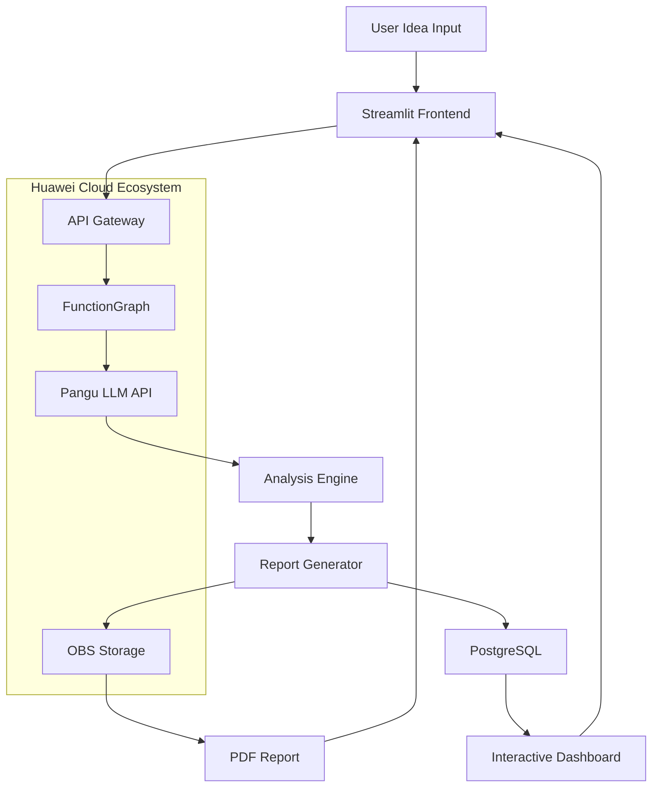

<div id="top">

<!-- HEADER STYLE: CLASSIC -->
<div align="center">


# <code>Idea2Launch</code>

<em>İAÜ ŞİRKET</em>

<!-- BADGES -->
<!-- local repository, no metadata badges. -->

<em>Technologies to be Used:</em>

         


</div>
<br>

---

## 📑 Contents
- [👁️ Overview](#️-overview)
- [👥 Team](#-team)
- [🎯 Problem](#-problem)
- [💡 Solution](#-solution)
- [🚀 Key Features](#-key-features)
- [🔧 Tech Stack](#-tech-stack)
- [🏗️ System Architecture](#️-system-architecture)
- [📊 Data Flow](#-data-flow)
- [🗓️ Roadmap](#️-roadmap)
- [🎯 MVP Demo Scenario](#️-mvp-demo-scenario)
---

## 👁️ Overview
Idea2Launch is an innovative AI-powered platform that transforms raw startup ideas into comprehensive, actionable business plans automatically. By leveraging advanced LLM technology and Huawei Cloud services, we eliminate the barriers between concept and execution.

Input: A simple startup idea
Output: A complete startup plan including:

- **Business model and vision summary**  
- **Market and segment analysis**  
- **SWOT analysis**  
- **MVP development plan**  
- **Technical architecture with Huawei Cloud integration**  
- **Financial projections and revenue model**  

All steps are automated via **LLM API** and **Huawei Cloud services**, providing users a fast and structured way to turn ideas into actionable startup plans.
## 👥 Team


| Rol | Üye | LinkedIn |
|------|--------|-----------|
| **LLM Specialist & Cloud Integration & Team Lead** | Berat Erol Çelik | [](https://www.linkedin.com/in/berat-erol-%C3%A7elik-513915258/) |
| **Backend** | Emre Aldemir | [](https://www.linkedin.com/in/emre-aldemir-1b2301293/) |
| **Frontend & UI/UX** | Umut Odabaş | [](https://www.linkedin.com/in/umut-odaba%C5%9F-8a26142a2/) |
| **AI & Machine Learning** | Ömer Altıntaş | [](https://www.linkedin.com/in/%C3%B6mer-alt%C4%B1nta%C5%9F-44773730b/) |
| **Data & Deep Learning** | Efkan Çıtak | [](https://www.linkedin.com/in/efkan-%C3%A7%C4%B1tak-b848a32a0/) |

---

## 🎯 Problem
Entrepreneurs and innovators face significant challenges when validating and planning startup ideas:

- Time-consuming Research: Weeks spent on market analysis and competitor research  
- Complex Planning: Difficulty creating structured business models and financial projections  
- Technical Barriers: Uncertainty about appropriate technology stack and architecture  
- Resource Intensive: High costs for professional business consulting  
- Analysis Paralysis: Overwhelming amount of information needed for informed decisions

Existing tools provide fragmented solutions but lack end-to-end automation from idea to actionable startup plan.

---

## 💡 Solution

Idea2Launch revolutionizes startup planning through AI automation:

**User Idea → AI Analysis → Comprehensive Startup Plan**

Automated Outputs:
- ✅ Business Summary - Clear vision and value proposition
- ✅ Market Analysis - Target audience, size, and growth trends
- ✅ Competitor Intelligence - SWOT analysis and differentiation strategy  
- ✅ Revenue Models - Subscription, SaaS, marketplace recommendations  
- ✅ MVP Roadmap - Feature prioritization and sprint planning  
- ✅ Technical Architecture - Huawei Cloud-optimized infrastructure
- ✅ Financial Projections - Cost analysis and revenue forecasting

This allows users to quickly evaluate and execute ideas with AI assistance.

---

## 🚀 Key Features

| Feature  | Description  | Status  |
|---------|-------------|---------|
| 💡 **Smart Idea Analysis** | AI-powered idea summarization and target audience definition | 🔄 In Development |
| 📊 **Market Intelligence** | Automated market segmentation and trend analysis | 🔄 In Development |
| 🎯 **Competitor SWOT** | Comprehensive competitive landscape with SWOT matrix | 🔄 In Development |
| 💰 **Revenue Modeling** | Multiple monetization strategy recommendations | 🔄 In Development |
| 🏗️ **MVP Planning** | Feature prioritization and development sprint planning | 🔄 In Development |
| ⚙️ **Tech Architecture** | Huawei Cloud service recommendations and system design | 🔄 In Development |
| 📈 **Financial Forecasting** | Automated cost and revenue projections | 🔄 In Development |
| 📄 **Multi-format Reports** | PDF, JSON, and interactive dashboard outputs | 🔄 In Development |

---

## 🔧 Tech Stack

### AI & Core Intelligence
  

### Huawei Cloud Services
   

### Backend & API
 

### Frontend & Presentation
 

---

## 🏗️ System Architecture


## 🏗️ Core Components

```sh
idea2launch/
├── 📱 frontend/
│   ├── streamlit_app.py
│   ├── components/
│   │   ├── idea_input.py
│   │   ├── dashboard.py
│   │   └── report_viewer.py
│   └── assets/
├── 🔧 backend/
│   ├── main.py (FastAPI)
│   ├── api/
│   │   ├── analyze.py
│   │   ├── similar.py
│   │   └── report.py
│   └── services/
│       ├── llm_service.py
│       └── huawei_cloud.py
├── 🧠 ai_models/
│   ├── prompt_engine.py
│   ├── analysis_engine.py
│   └── evaluation.py
└── 📊 deployment/
    ├── functiongraph/
    └── api_gateway/

```

### API Endpoints
| Endpoint | Method | Description |
|----------|--------|-------------|
| `/api/analyze` | POST | Main analysis endpoint for startup ideas |
| `/api/similar` | GET | Find similar ideas in database |
| `/api/report/{report_id}	` | GET | Retrieve generated reports |
| `/api/health` | GET | System status check |

### 📊 Data Flow
1. **Input Phase**:
- User submits startup idea via Streamlit interface
- Input validation and preprocessing

2. **Processing Phase**:
- Idea converted to embeddings using SentenceTransformers
- Similar idea search using vector similarity
- LLM analysis with structured prompts

3. **Analysis Phase**:
- Business model generation
- Market and competitor analysis
- Technical architecture planning
- Financial projections

4. **Output Phase**:
- Structured JSON report generation
- PDF report creation
- Interactive dashboard visualization
- Huawei Cloud architecture diagrams
---

## 🗓️ Roadmap
**Phase 1: Foundation (Current)**
-  ✅ Project Setup & Architecture Design
-  🔄 LLM Prompt Engineering & Integration
-  🔄 Basic FastAPI Backend Development
-  🔄 Streamlit UI Prototype

**Phase 2: Core Features**
-  ⏳ Huawei Cloud Services Integration
-  ⏳ Advanced Analysis Modules
-  ⏳ Report Generation System
-  ⏳ Database Design & Implementation

**Phase 3: Polish & Scale**
-  ⏳ Interactive Dashboard Features
-  ⏳ Advanced Visualization
-  ⏳ Performance Optimization
-  ⏳ Demo Preparation


---

## 🎯 MVP Demo Scenario

**Demo Flow: "Pet Care Mobile Application"**
**Step 1: Input**

```text
User enters: "A mobile app for pet owners to track veterinary appointments, 
vaccination schedules, and connect with local pet services"
```
**Step 2: AI Processing**
- 30-second analysis using Pangu LLM
- Automated research and structuring

**Step 3: Output Delivered**
- Business Summary: "PetCare Pro - All-in-one pet wellness platform"
- Target Market: 85M pet owners in target region, $15B market size
- Competitor SWOT: Analysis of 3 main competitors with differentiation strategy
- Revenue Model: Freemium + subscription + marketplace commission
- MVP Features: Appointment tracker, vaccine reminders, service marketplace
- Technical Stack: Huawei FunctionGraph + OBS + API Gateway + Mobile SDK
- Financials: 3-year projection with break-even analysis

**Step 4: Interactive Dashboard**
- Visual SWOT matrix
- MVP feature timeline
- Revenue projection charts
- Technical architecture diagram
---

[![][back-to-top]](#top)

</div>


[back-to-top]: https://img.shields.io/badge/-BACK_TO_TOP-151515?style=flat-square


---


